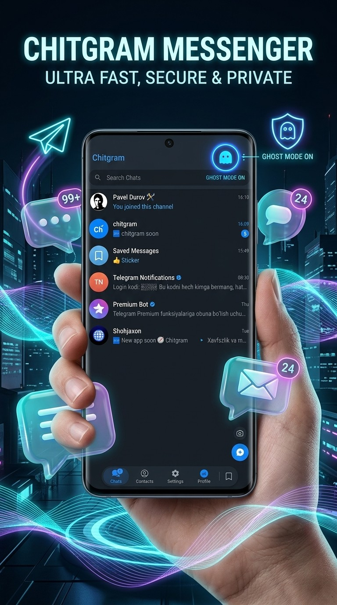
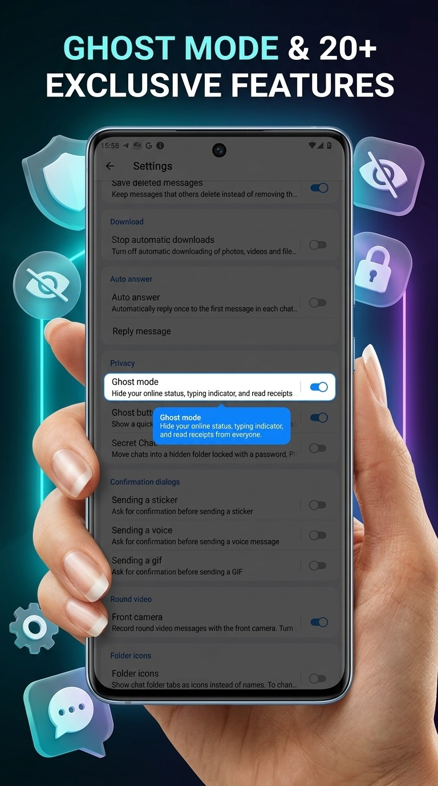
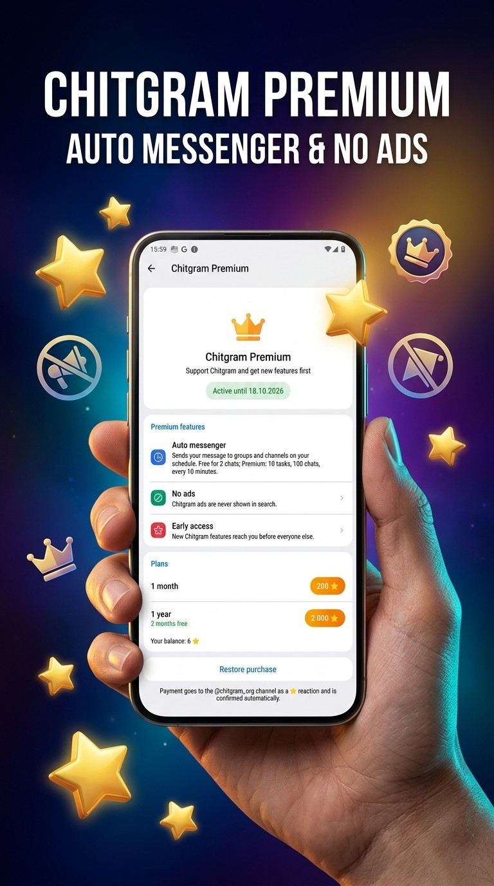
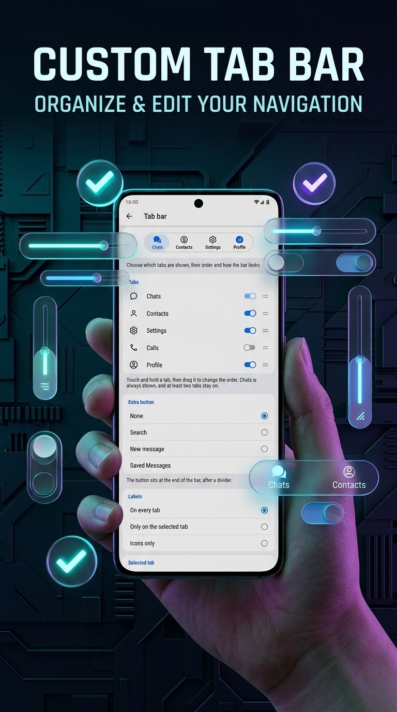
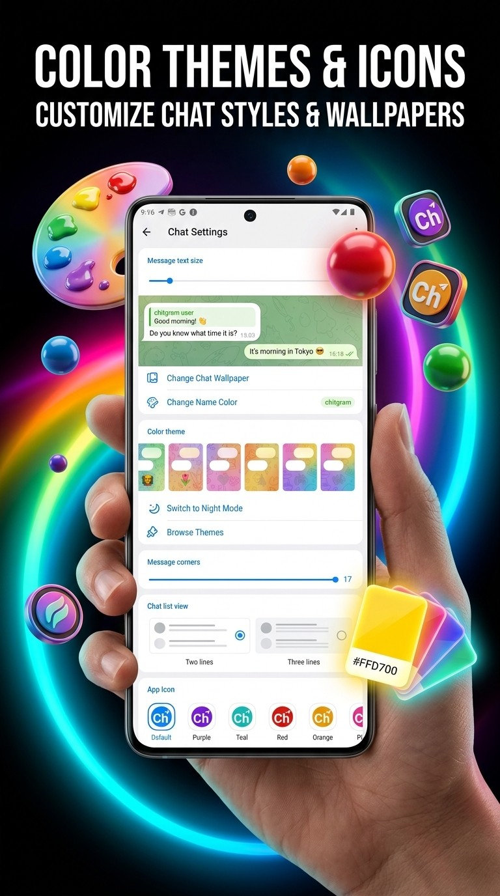
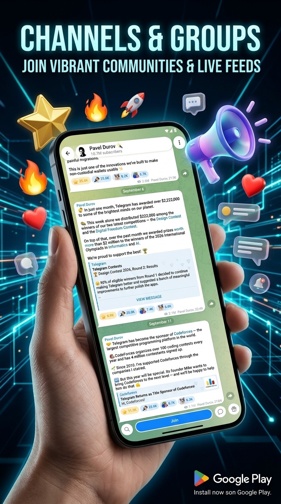
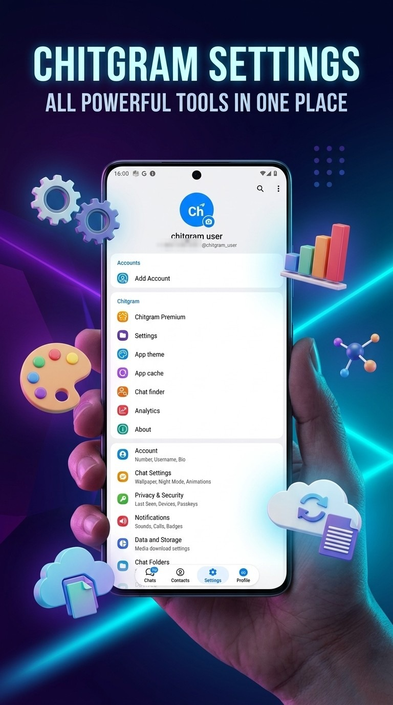
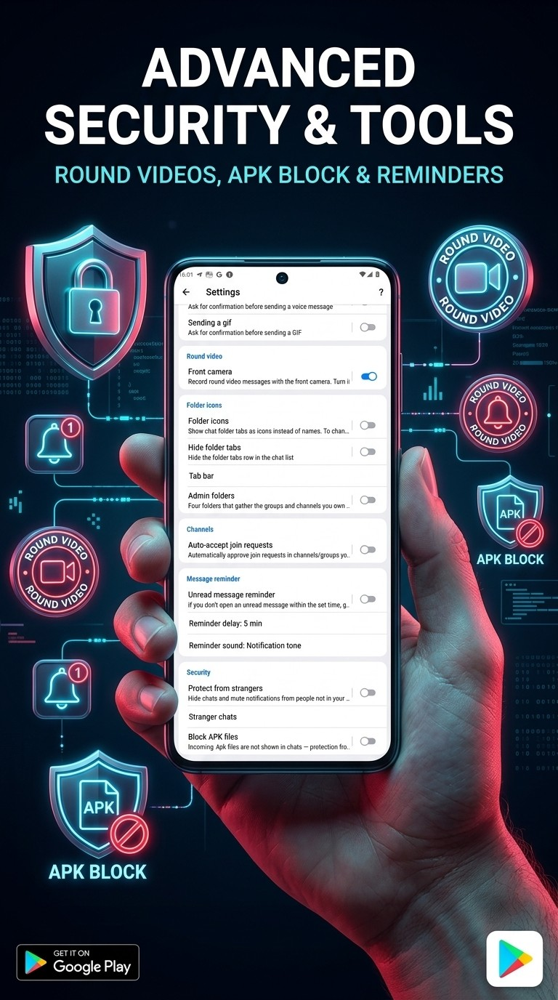

 

**Building Chitgram — Android + Web messenger** · Kotlin · TypeScript · React · Firebase

 

I build mobile & web products end-to-end — from native Android to the backend that powers them. Currently rebuilding the Telegram experience from the ground up with **Chitgram**.

 

### 🛠️ Tech Stack

  

### 📊 GitHub Stats

  

### 📫 Reach me

 

## 🚀 What I'm building

**Chitgram** — a Telegram-based messenger with its own identity: an auto messenger for groups and channels, ghost mode, chat lock, stranger protection, settings that sync across devices, Premium paid with Telegram Stars — and a matching web client.

  

 

**Toping** — a classifieds marketplace app for Uzbekistan: post listings, search nearby on a live map, and chat directly with buyers and sellers.

  

 

### 🎯 2026 Goals

- 🚀 Ship Chitgram to Google Play and its web client to the public
- 📈 Grow Toping's listings and user base
- 🧠 Go deeper on backend architecture & system design
- 🌱 Contribute to more open-source projects

 
