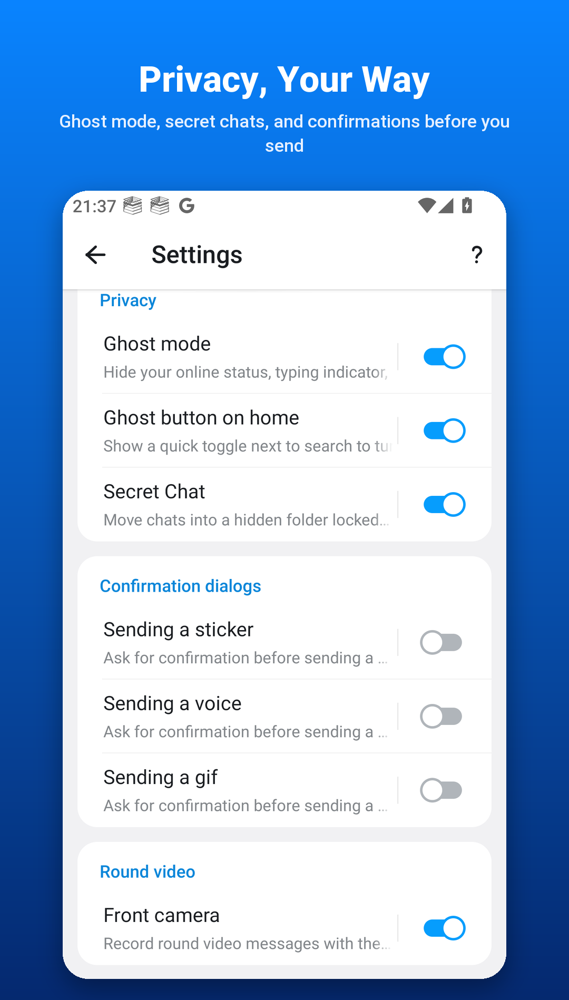
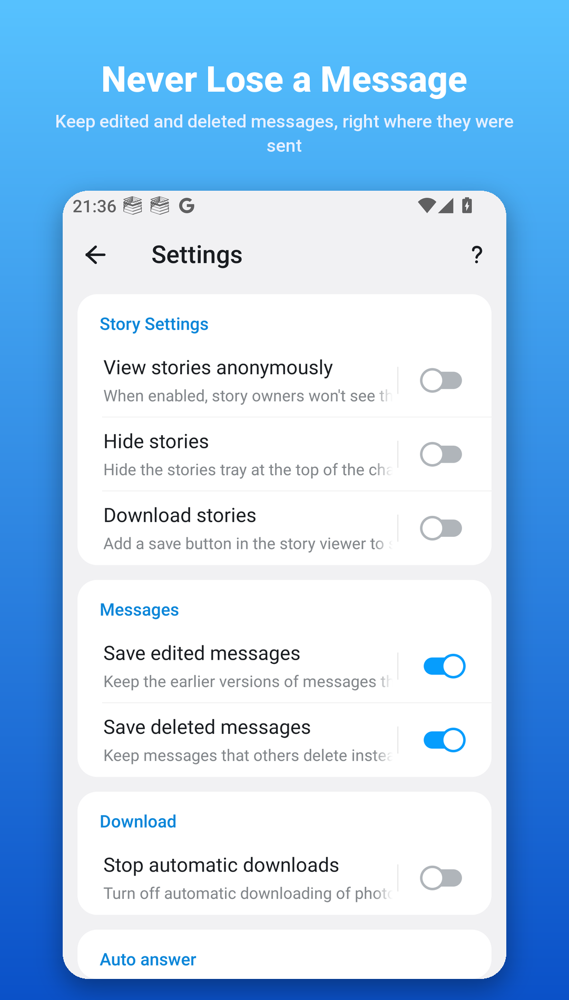
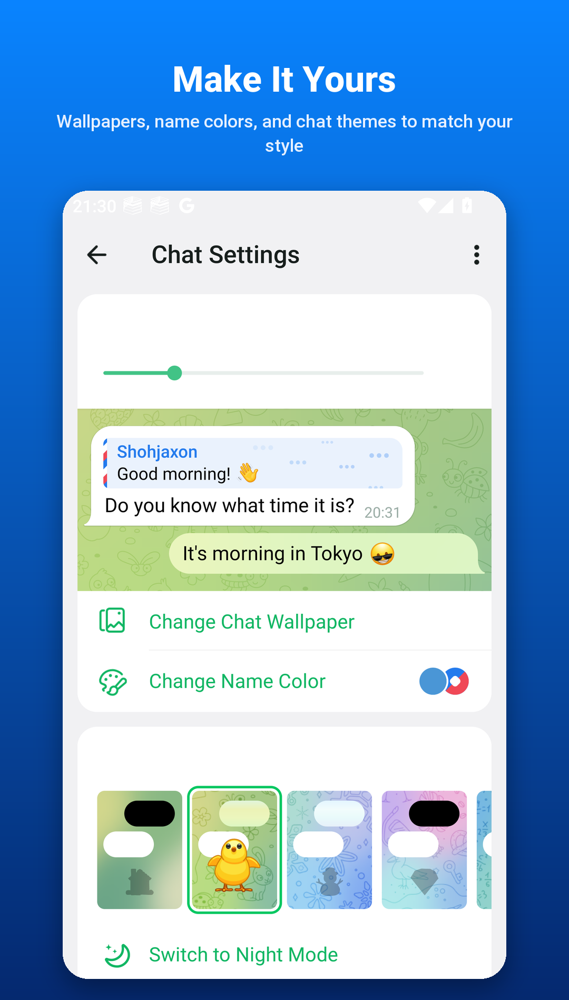
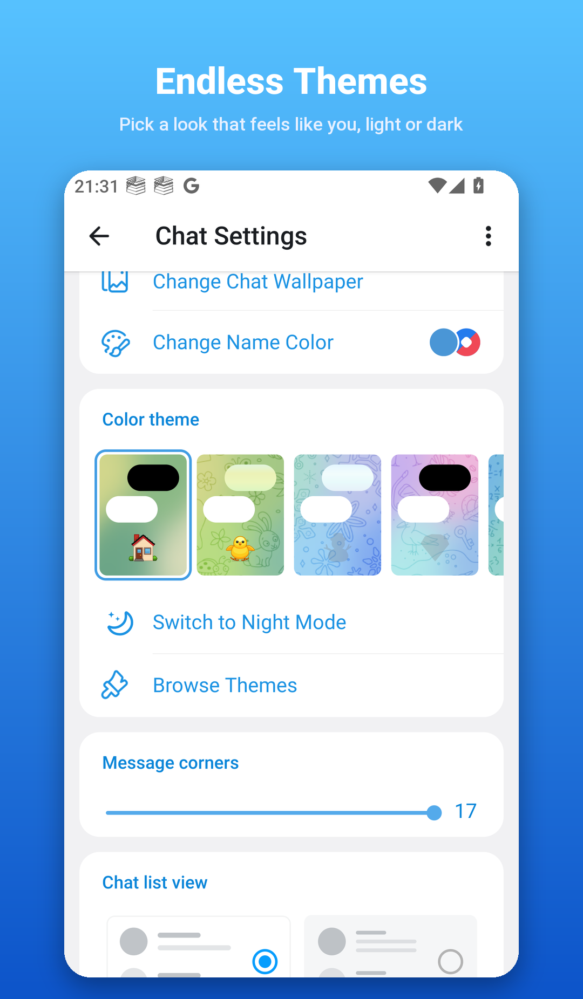
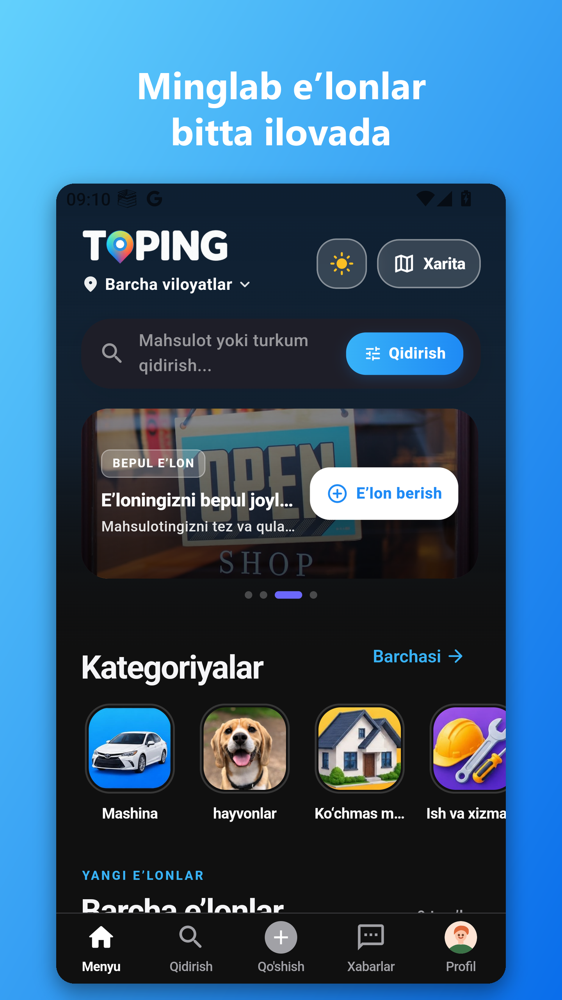
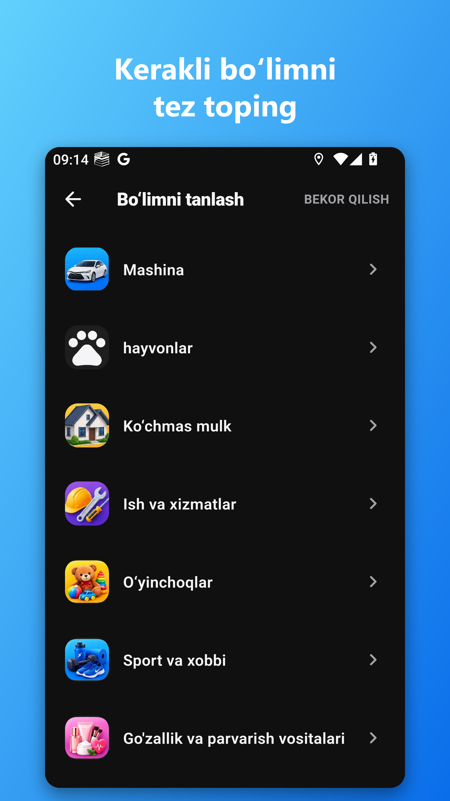
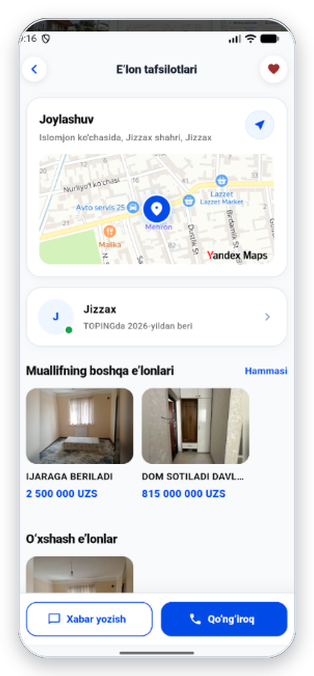
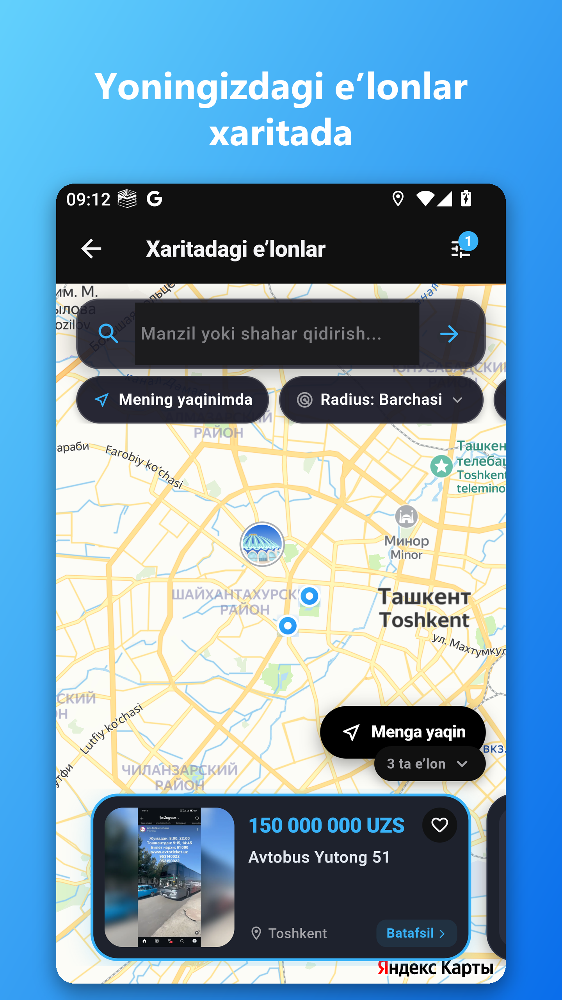

 

I build mobile & web products end-to-end — from native Android to the backend that powers them. Currently rebuilding the Telegram experience from the ground up with **Chatgram**.

 

### 🛠️ Tech Stack

  

### 📊 GitHub Stats

  

### 📫 Reach me

 

## 🚀 What I'm building

**Chatgram** — a Telegram-based messenger with its own identity: chat lock, stranger protection, AI-powered voice translation, deleted-message recovery, and a matching web client.

  

 

**Toping** — a classifieds marketplace app for Uzbekistan: post listings, search nearby on a live map, and chat directly with buyers and sellers.

  

 

